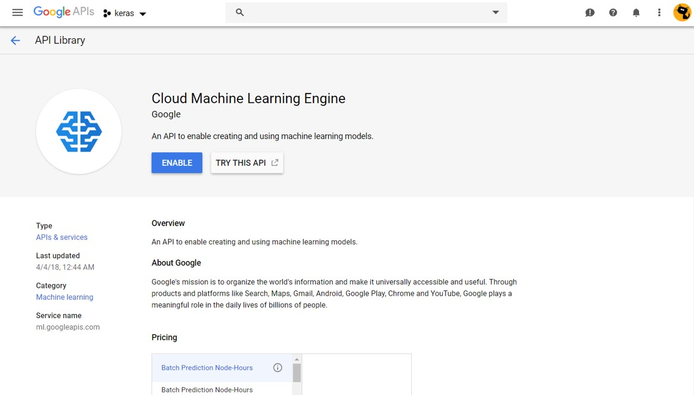
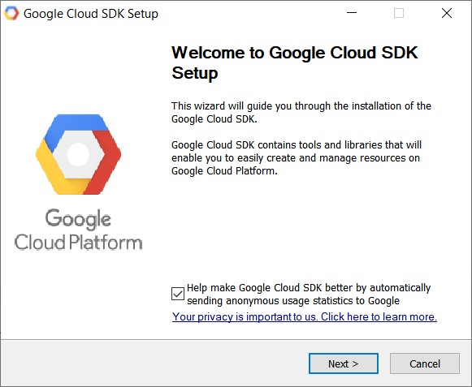

# Cloud ML Engine from R

> R project accompanying talk

This repo hosts all the code from the talk "Deep Learning in R with Keras and Google Cloud ML Engine", using the `cloudml` package from RStudio to submit training jobs to Google Cloud. It's not quite step-through code, as there's a bit of setup and some hard-coded IDs that you'll need to change, but it's a start for anyone dipping their toes into `cloudml`.

## Installation

You'll need to install and setup `cloudml` and, ideally, `keras`. CRAN versions are sufficient.

```r
install.packages(c("cloudml", "keras"))
```

Outside of the R packages there's a bit of external setup.

### Install Keras

See the [RStudio Setup guide](https://keras.rstudio.com/) for `keras`. I've always had Anaconda Python (version 3.X) installed before I've attempted this, and would recommend it, especially from Windows.

### Setup a Google Cloud Platform project

Over in your [GCP console](https://console.cloud.google.com) you'll want to either create a project, or choose an existing one.

Make sure you enable the ML engine API.




### Install Google Cloud SDK

You need the SDK installed and configured. You can kick this of from R with:

```r
library(cloudml)
gcloud_install()
```



and follow along with all the defaults. In my experience I had to run 

```r
gcloud_init()
```

again because it didn't quite configure the projects/usernames correctly the first time.

### RStudio Project

I recommend using an RStudio project for this. You'll notice the code has `here` statements peppered throughout, and these are a tool that anchors your file paths to the project root. If you clone this repo you'll see there's a project file in there so if you double click on that then you'll start off setup how I do, which should make things work more smoothly.

## Running the examples

You should just be able to step through the examples except for the ones with the images. For that you'll need to get the images into your GCP project yourself. You can download them from this storage bucket.

https://console.cloud.google.com/storage/browser/rkeras-book174

or direct using gs://rkeras-book174

Please copy this to your own bucket, or add a billing project, if you're going to use it regularly for training.
